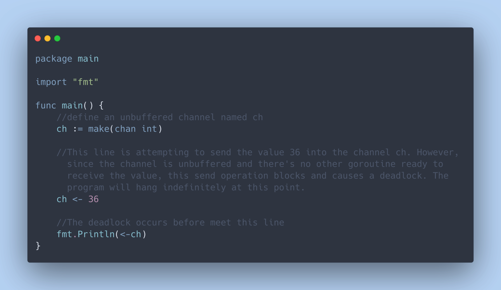

## Unbuffered Channel

- An unbuffered channel doesn't have any capacity to store values.
- When a sender sends a value on an unbuffered channel, it blocks until a receiver receives that value.
- Unbuffered channels are typically used for **synchronized communication** between goroutines.
- They enforce a direct exchange of data between sender and receiver, ensuring that the sender and receiver are both ready before the value is exchanged.

## Buffered Channel

- A buffered channel has a defined capacity to store values.
- When a sender sends a value on a buffered channel, it blocks only if the channel is full.
- When a receiver tries to receive from a buffered channel, it blocks only if the channel is empty.
- Buffered channels are useful when you want to decouple the timing of sender and receiver, allowing them to operate more independently.
- They can provide a degree of asynchrony, as the sender can continue sending even if the receiver is not immediately ready

